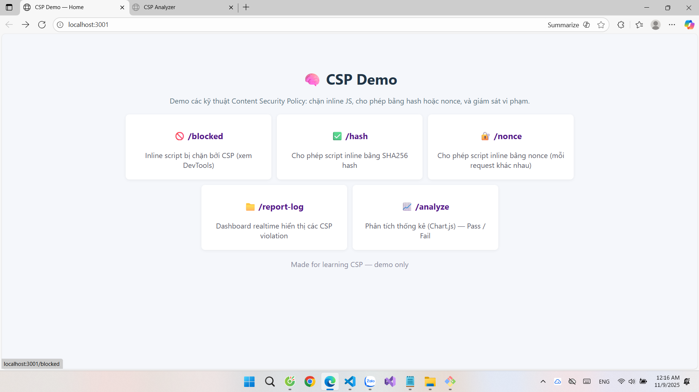
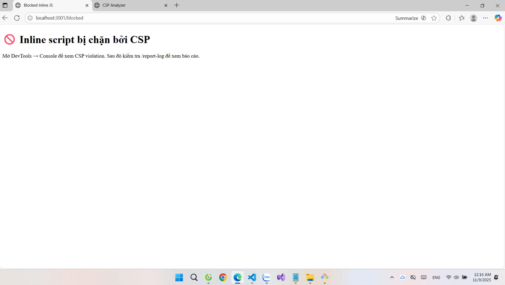
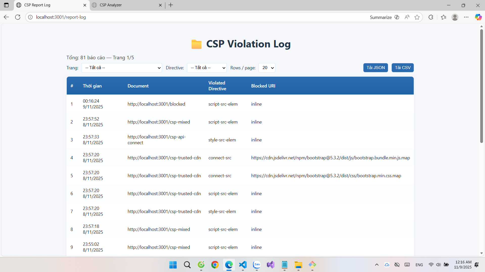
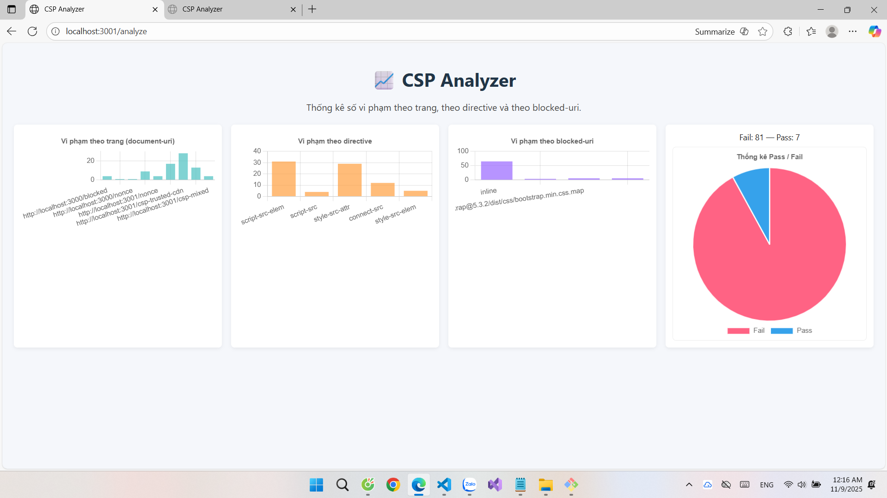

# 🛡️ Content Security Policy Advanced Demo

## 1. Giới thiệu

**CSP Advanced Demo** là ứng dụng web demo các kỹ thuật nâng cao về Content Security Policy, tập trung vào:

- Chặn inline JavaScript
- Cho phép script thông qua hash/nonce
- Giám sát và phân tích vi phạm CSP

Dự án này giúp sinh viên hiểu rõ về:

- Cách CSP bảo vệ ứng dụng web khỏi XSS
- Cơ chế hoạt động của script-src
- Sự khác biệt giữa hash và nonce
- Cách debug và theo dõi vi phạm CSP

## Tác giả

## 2. Công nghệ sử dụng

### 🖥️ Frontend

- Vanilla JavaScript
- Chart.js (biểu đồ phân tích)
- Socket.IO Client (realtime updates)
- HTML5 & CSS3

### ⚙️ Backend

- Node.js + Express.js
- Socket.IO (WebSocket)
- Helmet (security headers)
- Dotenv (environment variables)

### 📊 Logging & Storage

- JSON file-based storage
- Realtime event streaming

## 3. Cấu trúc thư mục

```
📁 csp-demo/
├── 📁 data/                 # Data storage
│   └── violations.json      # Backup của logs
├── 📁 logs/                 # Log files
│   └── violations.json      # CSP violation logs
├── 📁 public/              # Static files
│   ├── analyze.html        # Trang phân tích
│   ├── analyze.js          # Logic phân tích
│   ├── blocked.html        # Demo chặn inline script
│   ├── dashboard.html      # Dashboard realtime
│   ├── dashboard.js        # Logic dashboard
│   ├── hash.html          # Demo script hash
│   ├── index.html         # Trang chủ
│   ├── nonce_template.html # Demo script nonce
│   ├── report_log.html    # Xem logs
│   └── styles.css         # Global styles
├── 📁 scripts/             # Build scripts
│   └── build-hash.js      # Tính toán script hash
├── 📁 utils/               # Utilities
│   └── logger.js          # Log handling
├── .env                   # Environment variables
├── .gitignore            # Git ignore rules
├── package.json          # Dependencies
├── README.md            # Documentation
└── server.js            # Main server file
```

## 4. Yêu cầu hệ thống

- Node.js **v16+**
- npm hoặc yarn
- Modern web browser (Chrome/Firefox/Edge) với DevTools

## 5. Hướng dẫn cài đặt

### 5.1 Clone repository

```bash
git clone https://github.com/thlien20904/csp-advanced-demo.git
cd csp-advanced-demo
```

### 5.2 Cài đặt dependencies

```bash
npm install
```

### 5.3 Cấu hình môi trường

Tạo file `.env` trong thư mục gốc:

```
PORT=3001
HASH_CSP=sha256-xxx  # Sẽ được tự động cập nhật
```

### 5.4 Build script hash

```bash
node scripts/build-hash.js
```

### 5.5 Chạy ứng dụng

```bash
npm start
```

✅ Ứng dụng chạy tại:

- [http://localhost:3001](http://localhost:3001)

## 6. Demo Routes

| Route       | Mô tả                          |
| ----------- | ------------------------------ |
| /           | Trang chủ - Overview các demo  |
| /blocked    | Demo chặn inline script        |
| /hash       | Demo cho phép script qua hash  |
| /nonce      | Demo cho phép script qua nonce |
| /report-log | Xem log vi phạm CSP            |
| /analyze    | Phân tích vi phạm bằng biểu đồ |

## 7. Chức năng chính

### 🚫 Demo CSP Blocking

- Chặn hoàn toàn inline script
- Hiển thị vi phạm trong DevTools
- Ghi log vi phạm vào hệ thống

### ✅ Demo CSP Allowing

- Cho phép script qua SHA-256 hash
- Cho phép script qua nonce động
- So sánh hai phương pháp

### 📊 Monitoring & Analysis

- Dashboard realtime với Socket.IO
- Thống kê và biểu đồ vi phạm
- Xuất log dạng JSON/CSV

## 8. Hình ảnh minh họa

### 🏠 Trang chủ



### 🛑 Demo Blocked Script



### 📈 Dashboard & Analytics



### 📋 Report Logs



## 9. Tài liệu tham khảo

- [Content Security Policy - MDN](https://developer.mozilla.org/en-US/docs/Web/HTTP/CSP)
- [CSP Level 3 Specification](https://w3c.github.io/webappsec-csp/)
- [Google CSP Evaluator](https://csp-evaluator.withgoogle.com/)

## 📎 Links

- 🔗 Source Code:
  [https://github.com/thlien20904/csp-advanced-demo](https://github.com/thlien20904/csp-advanced-demo.git)

- 🎥 Video Demo:
  [Link to demo video]
